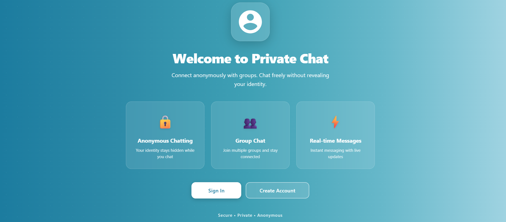
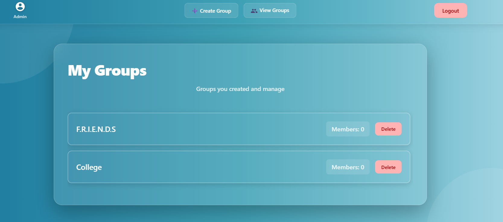
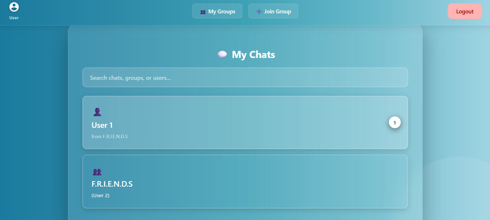
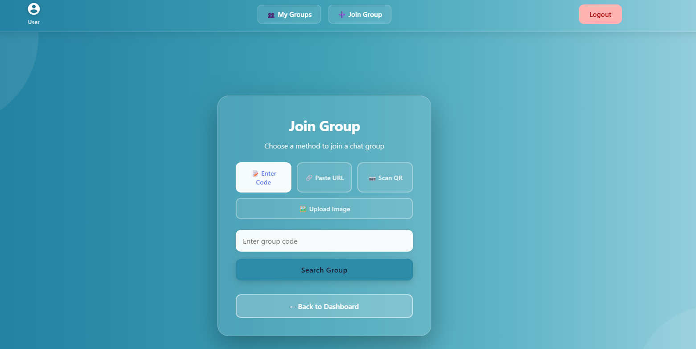
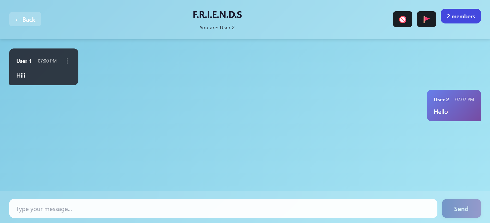

# 🔐 Anonymous Group Chat App  
*A Private, Identity-Free, Real-Time Group Chat Platform built with React + Firebase*

## 📘 Overview  
The **Anonymous Group Chat App** is a privacy-first, real-time communication platform where users can chat inside groups without revealing personal identity.  
Each user gets a **random anonymous alias**, ensuring complete privacy while still enjoying smooth, instant messaging.

This project fulfills all requirements of the **Private Chat App Assessment**.

---

## ⭐ Key Features

### 🔐 1. Anonymous Identity Per Group  
- No name, email, or personal info required.  
- Each user receives a random alias, such as:  
  - `User A`  
  - `User 1` 
- Ensures full privacy inside all groups.

---

### ⚡  2. Real-Time Messaging  
Powered by Firebase Firestore real-time listeners:
- Instant message sync  
- Auto-refresh  
- Zero page reload  
- Smooth chat auto-scroll  
- Clean bubble UI  

---

### 👤 3. Admin Controls  
Admins can:
- Create chat groups  
- Generate unique group codes  
- Share join links  
- Share QR codes  
- View total member count  

Admins **cannot** view any user’s identity.

---

### 🔗 4. Multiple Ways to Join Groups  
Users can join a group via:
- 🔤 Group Code  
- 🔗 Shareable Link  
- 📷 QR Code  

---

### 💬 5. Minimal, Clean Chat Interface  
- Anonymous name tags  
- Lightweight UI  
- Auto-scroll to the latest message  
- Modern bubble layout  
- Mobile-friendly and responsive  

---

### 🎨 6. Modern UI & Animations  
Designed using:
- Blue gradient theme  
- Glassmorphism cards  
- Smooth transitions  
- Soft shadows  
- Responsive layout  
- Stylish components  

---

## 🛠 Tech Stack

### **Frontend**
- React (Vite)
- React Router DOM
- Custom CSS3 (Glassmorphism + Gradients)
- Fully responsive UI

### **Cloud/Backend**
- Firebase Firestore  
- Firebase Authentication (Anonymous auth)

### **Libraries**
- `uuid` → generate anonymous usernames  
- `qrcode.react` → generate QR codes  

---


## 🚀 Setup & Run Instructions

Follow these steps to run the project locally:

### **1. Clone the repository**
```bash
git clone https://github.com/ishitagarg28/Chat_App
cd Chat_App
```

### **2. Install Dependencies**
```
npm install
```


### **3. Create environment variables**
**Create a file named .env in the root directory.**

**Add the  following**
```
VITE_FIREBASE_API_KEY=your_api_key
VITE_FIREBASE_AUTH_DOMAIN=your_auth_domain
VITE_FIREBASE_PROJECT_ID=your_project_id
VITE_FIREBASE_STORAGE_BUCKET=your_storage_bucket
VITE_FIREBASE_MESSAGING_SENDER_ID=your_sender_id
VITE_FIREBASE_APP_ID=your_app_id

```
### **4. Start the server**
```
npm run dev
```

### **5. Now open:**
```
http://localhost:5173
```


## 🧪 Features You Can Test

- **Create a group as Admin**  
- **Join with Code / Link / QR**  
- **Real-time messages (no reload)**  
- **Automatic anonymous user alias** 
- **Admin dashboard**  
- **User-only chat panel**  

---

## LIVE DEMO
[https://chat-app-5423.vercel.app/]


---
## 📸 App Screenshots


### 🏠 1. Landing Page  
  

---

### 🔐 2. Admin Dashboard  
  

---

### 🧩 3. Create Group (Admin)  
  

---

### 💬 4. User Dashboard  
  

---

### 🔗 5. Join Group (Code / Link / QR)  
  

---

### 💬 6. Anonymous Chat Room  
  

---


